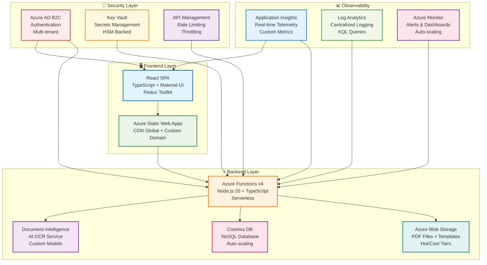
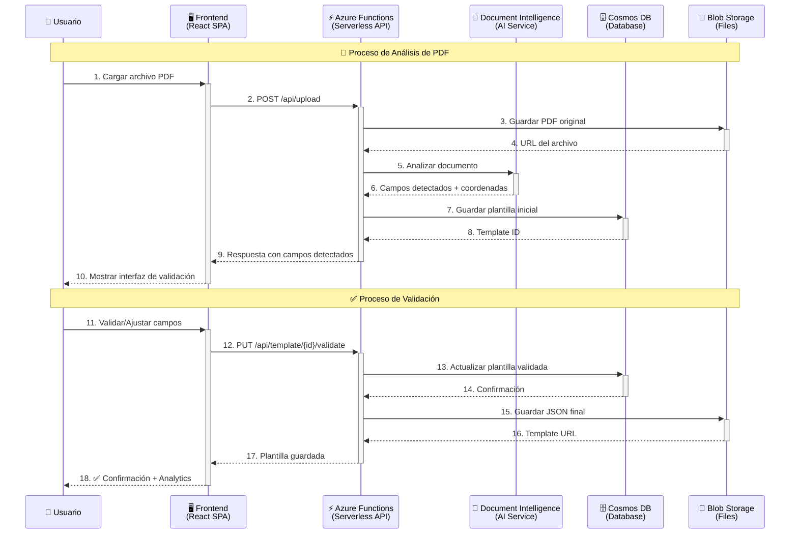

# Medical Forms Template Generator

Sistema de generación de plantillas para formularios médicos de aseguradoras mexicanas utilizando Azure Document Intelligence y React.


## 🏗️ Arquitectura del Sistema



## 🔄 Flujo de Datos



## 👥 Equipo del Proyecto

| Rol | Nombre | Responsabilidades | Contacto |
|-----|--------|-------------------|----------|
| **🎯 Project Manager** | **Luis Fernando Martínez Manrique** | • Gestión general del proyecto<br/>• Coordinación entre equipos<br/>• Seguimiento de timelines<br/>• Comunicación con stakeholders | [📧 Contacto](mailto:luis.fernando@clinicseo.com.mx) |
| **👨‍💼 Tech Lead** | **José de Jesús Martínez Manrique** | • Arquitectura técnica<br/>• Code reviews<br/>• Decisiones de tecnología<br/>• Mentoring del equipo | [📧 Contacto](mailto:Josedejesus@clinicseo.com.mxjesus@clinicseo.com) |
| **💻 Full Stack Developer** | **Francisco Javier Martínez Manrique** | • Desarrollo frontend (React)<br/>• Desarrollo backend (Azure Functions)<br/>• Integración de servicios<br/>• Testing e implementación | [📧 Contacto](mailto:francisco.javier@clinicseo.com.mx) |

## 🚀 Características

- 📄 **Análisis automático de PDFs** usando Azure Document Intelligence
- 🔍 **Detección inteligente de campos** con tipos mexicanos (RFC, CURP)
- 🎮 **Interfaz de validación gamificada** para mejor experiencia de usuario
- 📊 **Sistema de versionado** de plantillas con historial completo
- 📏 **Cálculo dimensional** de capacidad de campos automático
- 🔐 **Integración con Azure AD** para seguridad empresarial
- ⚡ **CI/CD automatizado** con GitHub Actions y Azure deployment

## 📋 Tecnologías

### Frontend
- **React 18** con TypeScript
- **Material-UI 5** para componentes
- **Redux Toolkit** para manejo de estado
- **React PDF** para visualización de documentos

### Backend
- **Azure Functions** v4 con Node.js 20
- **TypeScript** para tipado estático
- **Azure Document Intelligence** para procesamiento
- **Azure Cosmos DB** para almacenamiento

### Infraestructura
- **Azure Static Web Apps** para hosting
- **Azure Functions** para serverless backend
- **Azure Storage** para archivos y PDFs
- **Azure Key Vault** para secretos

## 🛠️ Instalación y Configuración

### Prerrequisitos
- Node.js 20+
- npm 9+
- Azure CLI
- Azure Subscription
- GitHub Account

### Configuración Local

```bash
# Clonar el repositorio
git clone https://github.com/CLINICseo/medical-forms-template-generator.git
cd medical-forms-template-generator

# Instalar dependencias
npm install

# Configurar variables de entorno
cp .env.example .env
# Editar .env con tus credenciales de Azure

# Iniciar desarrollo
npm run dev
```

### Variables de Entorno Requeridas

```bash
# Azure Configuration
AZURE_SUBSCRIPTION_ID=your-subscription-id
AZURE_TENANT_ID=your-tenant-id
AZURE_CLIENT_ID=your-client-id
AZURE_CLIENT_SECRET=your-client-secret

# Resource Configuration
RESOURCE_GROUP_NAME=rg-medical-forms-prod
STORAGE_ACCOUNT_NAME=stmedicalformsprod
COSMOS_DB_ENDPOINT=https://your-cosmos.documents.azure.com:443/
DOCUMENT_INTELLIGENCE_ENDPOINT=https://your-docint.cognitiveservices.azure.com/

# Application Settings
NODE_ENV=development
LOG_LEVEL=debug
```

## 🏃‍♂️ Comandos de Desarrollo

```bash
# Desarrollo
npm run dev              # Ejecutar frontend y backend
npm run dev:frontend     # Solo frontend
npm run dev:backend      # Solo backend

# Build
npm run build            # Build completo
npm run build:frontend   # Build del frontend
npm run build:backend    # Build del backend

# Testing
npm test                 # Ejecutar todos los tests
npm run test:frontend    # Tests del frontend
npm run test:backend     # Tests del backend
npm run test:coverage    # Tests con cobertura

# Calidad de Código
npm run lint             # Linting completo
npm run lint:fix         # Aplicar correcciones automáticas
npm run format           # Formatear código
npm run code-quality     # Verificación completa
npm run code-quality:fix # Correcciones automáticas
```

## 🚀 Despliegue

### Desarrollo
```bash
# Desplegar infraestructura
npm run deploy:dev

# Desplegar aplicación
npm run deploy:app:dev
```

### Producción
```bash
# Desplegar infraestructura
npm run deploy:prod

# Desplegar aplicación (automático via GitHub Actions)
git push origin main
```

## 📖 Documentación Adicional

- 📐 [Arquitectura del Sistema](./docs/architecture/overview.md)
- 🔧 [Guía de API](./docs/api/reference.md)
- 👥 [Guía de Contribución](./CONTRIBUTING.md)
- 🚀 [Guía de Despliegue](./docs/deployment/azure-setup.md)
- 🔒 [Configuración de Seguridad](./docs/security/setup.md)
- 📊 [Monitoreo y Logging](./docs/monitoring/setup.md)

## 🤝 Contribución

1. Fork el proyecto
2. Crear una rama feature (`git checkout -b feature/AmazingFeature`)
3. Commit los cambios (`git commit -m 'feat: add some AmazingFeature'`)
4. Push a la rama (`git push origin feature/AmazingFeature`)
5. Abrir un Pull Request

### Convenciones de Commits
Este proyecto usa [Conventional Commits](https://www.conventionalcommits.org/):

- `feat:` Nueva funcionalidad
- `fix:` Corrección de bugs
- `docs:` Cambios en documentación
- `style:` Formateo, punto y comas, etc.
- `refactor:` Refactorización de código
- `test:` Agregar o corregir tests
- `chore:` Tareas de mantenimiento

## 🐛 Reporte de Bugs

Para reportar bugs, usa nuestros templates de issues:

- 🐛 **Bug Report** - Para errores y problemas
- ✨ **Feature Request** - Para nuevas funcionalidades
- 📚 **Documentation** - Para mejoras en documentación

## 📈 Roadmap

### Versión 1.0 (Actual)
- ✅ Análisis básico de PDFs
- ✅ Detección de campos de texto
- ✅ Interfaz de validación
- ✅ Sistema de versionado
- ✅ CI/CD pipeline

### Versión 1.1 (Próximo Release)
- 🔄 Detección de tablas complejas
- 🔄 Soporte para formularios multi-página
- 🔄 API REST pública
- 🔄 Dashboard de analytics

### Versión 2.0 (Futuro)
- 📋 Machine Learning personalizado
- 📋 Integración con múltiples aseguradoras
- 📋 App móvil
- 📋 Marketplace de plantillas

## 📊 Métricas del Proyecto

- **Cobertura de Tests**: 85%+
- **Performance Score**: 95+
- **Accessibility Score**: 100
- **Time to Process**: < 30 segundos
- **Uptime**: 99.9%

## 📄 Licencia

Este proyecto es propietario y confidencial. Todos los derechos reservados.

**Copyright (c) 2025 CLINICseo**  
Todos los derechos reservados.

Este software es propietario y confidencial.  
La distribución, modificación o uso no autorizado está prohibido.

## 🙏 Agradecimientos

- **Azure Team** por el excelente soporte de Document Intelligence
- **React Community** por las librerías increíbles
- **TypeScript Team** por hacer JavaScript mejor
- **GitHub** por las herramientas de desarrollo

---

⭐ **¡Dale una estrella si este proyecto te ayuda!**

🆘 **¿Necesitas ayuda?**
- 📧 **Email**: [soporte@clinicseo.com](mailto:soporte@clinicseo.com)
- 💬 **Teams**: Canal #medical-forms-support
- 📚 **Wiki**: [Documentación completa](./docs/README.md)
