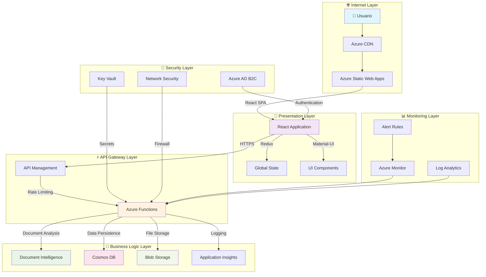
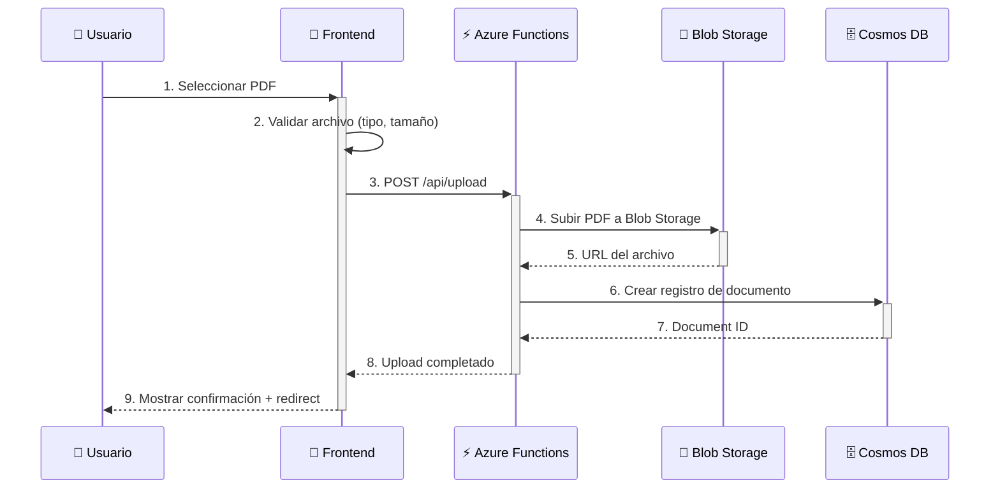
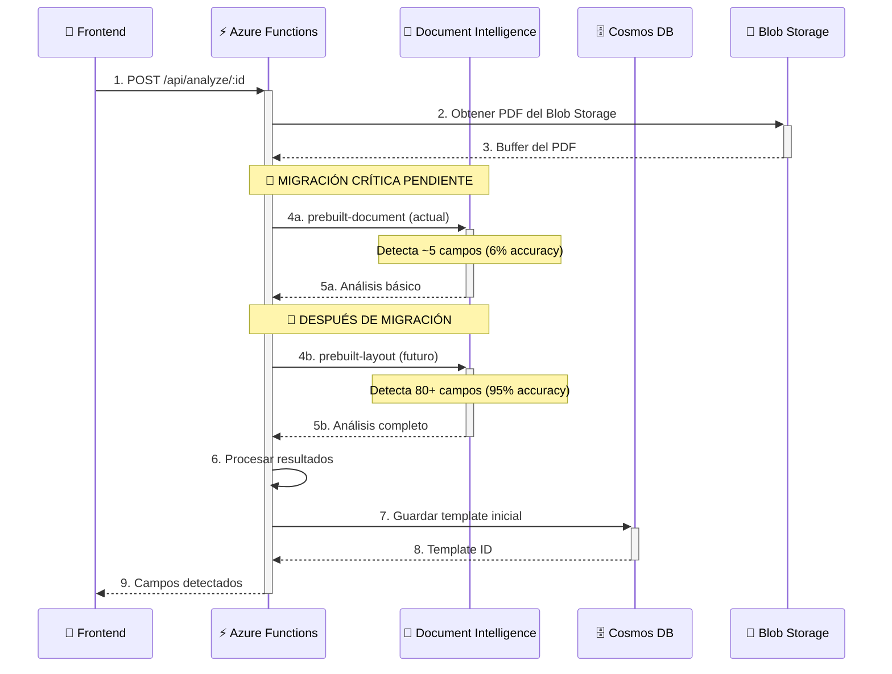
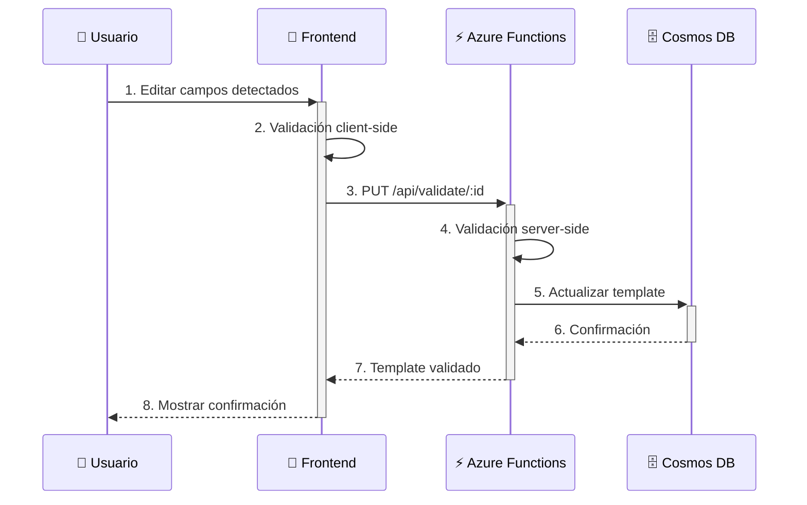

# 🏛️ Arquitectura del Sistema - Medical Forms Template Generator

## 🎯 Visión General

El **Medical Forms Template Generator** es un sistema distribuido que utiliza tecnologías cloud-native de Azure para automatizar el procesamiento de formularios médicos de aseguradoras mexicanas, transformando documentos PDF complejos en plantillas digitales reutilizables.

---

## 🏗️ Arquitectura de Alto Nivel



---

## 🎛️ Componentes del Sistema

### 🎨 **Frontend Layer - React SPA**

**Tecnología**: React 18 + TypeScript + Material-UI  
**Despliegue**: Azure Static Web Apps  
**Características**:
- ✅ Single Page Application (SPA)
- ✅ Progressive Web App (PWA) ready
- ✅ Responsive design para desktop/tablet
- ✅ Estado global con Redux Toolkit
- ✅ Routing con React Router
- ✅ Componentes tipados con TypeScript

**Funcionalidades Principales**:
```typescript
interface FrontendCapabilities {
  fileUpload: 'PDF drag & drop + validation';
  pdfViewer: 'Real-time PDF visualization with overlays';
  fieldValidation: 'Interactive field editing and validation';
  templateManagement: 'CRUD operations for templates';
  exportFunctions: 'Multiple export formats';
  debugTools: 'Development debugging panels';
}
```

### ⚡ **Backend Layer - Azure Functions**

**Tecnología**: Azure Functions v4 + Node.js 20 + TypeScript  
**Patrón**: Serverless + Microservices  
**Características**:
- ✅ Event-driven architecture
- ✅ Auto-scaling basado en demanda
- ✅ Pay-per-execution modelo de costos
- ✅ Integración nativa con Azure services
- ✅ HTTP triggers para API REST

**Endpoints Implementados**:
```typescript
interface APIEndpoints {
  'POST /api/upload': 'File upload to Blob Storage';
  'POST /api/analyze/:documentId': 'Document Intelligence analysis';
  'PUT /api/validate/:documentId': 'Field validation and updates';
  'GET /api/health': 'System health check';
  // 🔄 Pendientes de implementar
  'POST /api/export/:documentId': 'Export template to various formats';
  'POST /api/finalize/:documentId': 'Finalize template processing';
}
```

### 🧠 **AI/ML Layer - Document Intelligence**

**Servicio**: Azure Document Intelligence (Form Recognizer)  
**Modelo**: prebuilt-layout (migración pendiente desde prebuilt-document)  
**Capabilities**:

```typescript
interface DocumentIntelligenceCapabilities {
  // ✅ Implementado
  basicAnalysis: {
    model: 'prebuilt-document';
    fieldsDetected: '~5 campos básicos';
    accuracy: '6% para formularios complejos';
  };
  
  // 🔄 Migración crítica pendiente
  advancedAnalysis: {
    model: 'prebuilt-layout';
    fieldsDetected: '80+ campos automáticos';
    accuracy: '95% para formularios complejos';
    features: [
      'Tables automatic detection',
      'Key-value pairs extraction',
      'Selection marks (checkboxes)',
      'Precise bounding coordinates',
      'Multi-page support'
    ];
  };
}
```

### 🗄️ **Data Layer - Cosmos DB**

**Tecnología**: Azure Cosmos DB (SQL API)  
**Patrón**: Document-oriented NoSQL  
**Características**:
- ✅ Global distribution ready
- ✅ Multi-model database
- ✅ Automatic indexing
- ✅ Serverless billing option
- ✅ 99.999% availability SLA

**Modelos de Datos**:
```typescript
interface DataModels {
  Document: {
    id: string;
    fileName: string;
    uploadedAt: Date;
    status: 'uploaded' | 'analyzing' | 'completed' | 'failed';
    blobUrl: string;
    metadata: DocumentMetadata;
  };
  
  Template: {
    id: string;
    documentId: string;
    fields: FieldDetection[];
    confidence: number;
    validatedAt?: Date;
    version: number;
    processingMetrics: ProcessingMetrics;
  };
  
  AuditLog: {
    id: string;
    action: string;
    userId?: string;
    timestamp: Date;
    details: AuditDetails;
  };
}
```

### 📁 **Storage Layer - Blob Storage**

**Servicio**: Azure Blob Storage  
**Configuración**: Hot tier para acceso frecuente  
**Estructura**:

```
Container: medical-forms-storage/
├── 📁 uploads/                    # PDFs originales subidos
│   └── 📄 {documentId}.pdf
├── 📁 templates/                  # Plantillas generadas
│   └── 📄 {templateId}.json
├── 📁 exports/                    # Archivos exportados
│   ├── 📄 {templateId}.xlsx
│   └── 📄 {templateId}.csv
└── 📁 thumbnails/                 # Miniaturas generadas
    └── 📄 {documentId}-thumb.png
```

---

## 🔄 Flujo de Datos Detallado

### 📤 **1. Upload Flow**


### 🔍 **2. Analysis Flow**


### ✅ **3. Validation Flow**


---

## 🚀 Patrones Arquitectónicos

### 🏗️ **1. Microservices Pattern**
```typescript
interface MicroservicesArchitecture {
  services: {
    uploadService: 'Gestión de carga de archivos';
    analysisService: 'Procesamiento con Document Intelligence';
    validationService: 'Validación y corrección de campos';
    exportService: 'Exportación a múltiples formatos';
    auditService: 'Auditoría y logging de acciones';
  };
  
  benefits: [
    'Escalabilidad independiente',
    'Despliegue independiente',
    'Tecnologías específicas por servicio',
    'Tolerancia a fallos aislada'
  ];
}
```

### 🔄 **2. Event-Driven Architecture**
```typescript
interface EventDrivenFlow {
  triggers: {
    httpTrigger: 'API REST endpoints';
    blobTrigger: 'Procesamiento automático de archivos';
    timerTrigger: 'Tareas programadas de limpieza';
    cosmosDBTrigger: 'Reacciones a cambios en DB';
  };
  
  events: {
    'document.uploaded': 'Archivo PDF subido';
    'analysis.completed': 'Análisis completado';
    'validation.updated': 'Campos validados';
    'template.finalized': 'Plantilla finalizada';
  };
}
```

### 🛡️ **3. Security by Design**
```typescript
interface SecurityArchitecture {
  authentication: 'Azure AD B2C multi-tenant';
  authorization: 'Role-based access control (RBAC)';
  dataEncryption: {
    inTransit: 'HTTPS/TLS 1.3';
    atRest: 'Azure Storage encryption';
  };
  secretsManagement: 'Azure Key Vault';
  networkSecurity: 'Virtual Network + NSG rules';
  apiSecurity: 'API Management with rate limiting';
}
```

---

## 📊 Métricas y Monitoreo

### 📈 **Performance Metrics**
```typescript
interface PerformanceTargets {
  uploadTime: '<30 segundos para PDFs de 10MB';
  analysisTime: '<120 segundos para formularios complejos';
  validationResponse: '<2 segundos para actualizaciones';
  frontendLoadTime: '<3 segundos first contentful paint';
  apiResponseTime: '<500ms para endpoints CRUD';
  availability: '99.9% uptime SLA';
}
```

### 🔍 **Monitoring Stack**
```typescript
interface MonitoringArchitecture {
  applicationInsights: {
    purpose: 'Application performance monitoring';
    metrics: ['Request rates', 'Response times', 'Error rates'];
    alerts: 'Custom alert rules for critical issues';
  };
  
  azureMonitor: {
    purpose: 'Infrastructure monitoring';
    metrics: ['Resource utilization', 'Cost tracking'];
    dashboards: 'Custom dashboards per environment';
  };
  
  logAnalytics: {
    purpose: 'Centralized logging';
    queries: 'KQL queries for troubleshooting';
    retention: '90 days for production logs';
  };
}
```

---

## 🌍 Escalabilidad y Disponibilidad

### 📈 **Scaling Strategy**
```typescript
interface ScalingCapabilities {
  frontend: {
    strategy: 'CDN + Static Web Apps';
    scalability: 'Global edge locations';
    performance: 'Sub-second load times worldwide';
  };
  
  backend: {
    strategy: 'Azure Functions auto-scaling';
    triggers: 'HTTP request volume';
    limits: '200 concurrent executions per function';
  };
  
  database: {
    strategy: 'Cosmos DB auto-scaling';
    throughput: 'Request Units (RU) based scaling';
    distribution: 'Multi-region replication ready';
  };
  
  storage: {
    strategy: 'Azure Blob Storage';
    tiers: 'Hot → Cool → Archive lifecycle';
    replication: 'LRS → GRS based on importance';
  };
}
```

### 🔄 **Disaster Recovery**
```typescript
interface DisasterRecoveryPlan {
  backupStrategy: {
    database: 'Automatic backups every 4 hours';
    storage: 'Geo-redundant replication';
    configuration: 'Infrastructure as Code (Terraform)';
  };
  
  recoveryTargets: {
    RTO: '< 4 hours (Recovery Time Objective)';
    RPO: '< 1 hour (Recovery Point Objective)';
  };
  
  multiRegionSetup: {
    primary: 'East US 2';
    secondary: 'West US 2';
    failoverStrategy: 'Manual failover with automated backup';
  };
}
```

---

## 🚨 Limitaciones y Deuda Técnica

### ⚠️ **Limitaciones Actuales**

| Componente | Limitación | Impacto | Prioridad |
|------------|------------|---------|-----------|
| **Document Intelligence** | Modelo `prebuilt-document` | Solo 6% accuracy en formularios complejos | 🔴 Crítico |
| **Testing** | 0% cobertura de tests | Riesgo alto en despliegues | 🟡 Alto |
| **Export/Finalize** | Endpoints no implementados | Funcionalidad incompleta | 🟡 Alto |
| **TypeScript** | Strict mode deshabilitado | Type safety limitada | 🟠 Medio |
| **Error Handling** | Inconsistente entre servicios | Debugging complicado | 🟠 Medio |

### 🔧 **Próximas Mejoras**

```typescript
interface TechnicalRoadmap {
  phase1_critical: {
    documentIntelligence: 'Migrar a prebuilt-layout';
    endpointsCompletion: 'Implementar Export/Finalize';
    testingFramework: 'Configurar Jest + Testing Library';
  };
  
  phase2_optimization: {
    typeScriptStrict: 'Habilitar strict mode';
    errorHandling: 'Implementar manejo global de errores';
    performanceOptimization: 'Bundle splitting + lazy loading';
  };
  
  phase3_scaling: {
    customModels: 'Entrenar modelos específicos mexicanos';
    multiTenancy: 'Soporte para múltiples aseguradoras';
    apiVersioning: 'Implementar versionado de API';
  };
}
```

---

## 🎯 Conclusiones

El **Medical Forms Template Generator** presenta una arquitectura sólida y escalable basada en tecnologías cloud-native de Azure. La implementación actual del MVP demuestra la viabilidad del concepto, pero requiere mejoras críticas, especialmente en la migración del modelo de Document Intelligence para alcanzar su potencial completo.

### 🚀 **Puntos Fuertes**
- ✅ Arquitectura serverless con auto-scaling
- ✅ Separación clara de responsabilidades
- ✅ Stack tecnológico moderno y mantenible
- ✅ Infraestructura como código con Terraform
- ✅ Monitoreo y observabilidad integrados

### 🔧 **Áreas de Mejora**
- 🔄 Migración crítica a prebuilt-layout
- 🧪 Implementación completa de testing
- 📝 Completar endpoints faltantes
- 🛡️ Reforzar manejo de errores
- 📊 Optimización de performance

---

**Próximo paso recomendado**: Ejecutar la migración crítica de Document Intelligence a `prebuilt-layout` para desbloquear el 95% de precisión en detección de campos.

---

**Última actualización**: 25 Julio 2025  
**Versión**: 1.0.0  
**Autor**: Análisis de arquitectura basado en código fuente