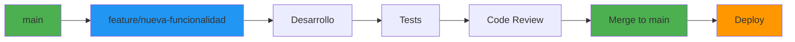

# 🛠️ Guía de Desarrollo - Medical Forms Template Generator

## 🎯 Introducción

Esta guía proporciona toda la información necesaria para desarrollar efectivamente en el proyecto **Medical Forms Template Generator**. Incluye workflows, estándares, mejores prácticas y herramientas esenciales.

---

## 🚀 Quick Start para Desarrolladores

### 📋 **Checklist de Primer Día**

```bash
# ✅ 1. Verificar prerrequisitos
node --version    # Debe ser 20+
npm --version     # Debe ser 9+
git --version     # Cualquier versión reciente

# ✅ 2. Clonar y configurar
git clone https://github.com/CLINICseo/medical-forms-template-generator.git
cd medical-forms-template-generator
npm install

# ✅ 3. Configurar variables de entorno
cp backend/local.settings.example.json backend/local.settings.json
# Editar con credenciales de Azure

# ✅ 4. Verificar que todo funciona
npm run build
npm run lint
npm run dev  # Debe abrir frontend en puerto 3000
```

### 🔧 **Estructura de Comandos Diarios**

```bash
# Desarrollo diario
npm run dev              # Iniciar frontend + backend
npm run dev:frontend     # Solo React (puerto 3000)
npm run dev:backend      # Solo Azure Functions (puerto 7071)

# Antes de commit
npm run lint             # Verificar linting
npm run format           # Formatear código
npm run build            # Verificar que compila
npm run test             # Ejecutar tests (cuando estén implementados)
```

---

## 🏗️ Workflows de Desarrollo

### 🌿 **Git Workflow**



### 📝 **Proceso de Feature Development**

1. **📋 Planificación**
   ```bash
   # Crear rama desde main actualizado
   git checkout main
   git pull origin main
   git checkout -b feature/descripcion-corta
   ```

2. **💻 Desarrollo**
   ```bash
   # Desarrollo iterativo con commits frecuentes
   git add .
   git commit -m "feat(scope): descripción del cambio"
   
   # Push frecuente para backup
   git push origin feature/descripcion-corta
   ```

3. **🧪 Testing**
   ```bash
   # Verificar calidad antes de PR
   npm run build
   npm run lint
   npm run test
   npm run format:check
   ```

4. **🔄 Pull Request**
   - Usar el template de PR del CONTRIBUTING.md
   - Solicitar review de al menos 1 desarrollador
   - Verificar que CI/CD pasa

---

## 🎨 Frontend Development

### ⚛️ **React Development Standards**

```typescript
// ✅ Ejemplo de componente bien estructurado
import React, { useState, useEffect } from 'react';
import { Box, Typography, Button } from '@mui/material';
import { useAppSelector, useAppDispatch } from '../hooks/redux';

interface DocumentViewerProps {
  documentId: string;
  onFieldSelect: (fieldId: string) => void;
  isReadOnly?: boolean;
}

export const DocumentViewer: React.FC<DocumentViewerProps> = ({
  documentId,
  onFieldSelect,
  isReadOnly = false
}) => {
  // 1. Hooks al inicio
  const [loading, setLoading] = useState(false);
  const dispatch = useAppDispatch();
  const document = useAppSelector(state => 
    state.documents.items.find(doc => doc.id === documentId)
  );

  // 2. Effects después de hooks
  useEffect(() => {
    if (!document) {
      // Cargar documento si no existe
      dispatch(fetchDocument(documentId));
    }
  }, [documentId, document, dispatch]);

  // 3. Handlers
  const handleFieldClick = (fieldId: string) => {
    if (!isReadOnly) {
      onFieldSelect(fieldId);
    }
  };

  // 4. Early returns
  if (loading) {
    return <LoadingSpinner />;
  }

  if (!document) {
    return <ErrorMessage message="Documento no encontrado" />;
  }

  // 5. Render
  return (
    <Box sx={{ p: 2 }}>
      <Typography variant="h6" gutterBottom>
        {document.fileName}
      </Typography>
      {/* Resto del componente */}
    </Box>
  );
};
```

### 🎨 **Material-UI Guidelines**

```typescript
// ✅ Usar sx prop para styling
<Box sx={{ 
  display: 'flex', 
  flexDirection: 'column', 
  gap: 2,
  p: 3 
}}>

// ✅ Usar theme colors
<Button 
  variant="contained" 
  color="primary"
  sx={{ 
    bgcolor: 'primary.main',
    '&:hover': { bgcolor: 'primary.dark' }
  }}
>

// ✅ Responsive design
<Grid container spacing={2}>
  <Grid item xs={12} md={6}>
    <Card>...</Card>
  </Grid>
</Grid>
```

### 📊 **Redux State Management**

```typescript
// ✅ Estructura de slice recomendada
import { createSlice, createAsyncThunk } from '@reduxjs/toolkit';

// Async thunk
export const fetchDocuments = createAsyncThunk(
  'documents/fetchDocuments',
  async (_, { rejectWithValue }) => {
    try {
      const response = await documentsApi.getAll();
      return response.data;
    } catch (error) {
      return rejectWithValue(error.message);
    }
  }
);

// Slice
const documentsSlice = createSlice({
  name: 'documents',
  initialState: {
    items: [],
    loading: false,
    error: null
  },
  reducers: {
    clearError: (state) => {
      state.error = null;
    }
  },
  extraReducers: (builder) => {
    builder
      .addCase(fetchDocuments.pending, (state) => {
        state.loading = true;
      })
      .addCase(fetchDocuments.fulfilled, (state, action) => {
        state.loading = false;
        state.items = action.payload;
      })
      .addCase(fetchDocuments.rejected, (state, action) => {
        state.loading = false;
        state.error = action.payload;
      });
  }
});
```

---

## ⚡ Backend Development

### 🔧 **Azure Functions Standards**

```typescript
// ✅ Estructura de función recomendada
import { app, HttpRequest, HttpResponseInit, InvocationContext } from '@azure/functions';
import { z } from 'zod'; // Para validación
import { errorHandler } from '../shared/utils/error-handler';
import { logger } from '../shared/utils/logger';

// Schema de validación
const uploadRequestSchema = z.object({
  fileName: z.string().min(1),
  fileSize: z.number().positive(),
  contentType: z.string().includes('pdf')
});

export async function uploadDocument(
  request: HttpRequest, 
  context: InvocationContext
): Promise<HttpResponseInit> {
  const startTime = Date.now();
  
  try {
    // 1. Validar entrada
    const body = await request.json();
    const validatedData = uploadRequestSchema.parse(body);
    
    // 2. Logging estructurado
    logger.info('Upload initiated', {
      fileName: validatedData.fileName,
      fileSize: validatedData.fileSize,
      requestId: context.invocationId
    });

    // 3. Lógica de negocio
    const result = await processUpload(validatedData);

    // 4. Respuesta estandarizada
    const processingTime = Date.now() - startTime;
    
    return {
      status: 200,
      jsonBody: {
        success: true,
        data: result,
        metadata: {
          requestId: context.invocationId,
          processingTime
        }
      }
    };

  } catch (error) {
    // 5. Manejo de errores centralizado
    return errorHandler.handleHttpError(error, context);
  }
}

// Registrar función
app.http('upload', {
  methods: ['POST'],
  authLevel: 'anonymous',
  route: 'upload',
  handler: uploadDocument
});
```

### 🗄️ **Database Patterns**

```typescript
// ✅ Patrón Repository
export class DocumentRepository {
  private container: Container;

  constructor(cosmosClient: CosmosClient) {
    this.container = cosmosClient
      .database('medical-forms')
      .container('documents');
  }

  async create(document: CreateDocumentDto): Promise<Document> {
    const newDocument: Document = {
      id: generateId(),
      ...document,
      createdAt: new Date(),
      updatedAt: new Date()
    };

    const { resource } = await this.container.items.create(newDocument);
    return resource;
  }

  async findById(id: string): Promise<Document | null> {
    try {
      const { resource } = await this.container.item(id).read();
      return resource || null;
    } catch (error) {
      if (error.code === 404) return null;
      throw error;
    }
  }

  async update(id: string, updates: Partial<Document>): Promise<Document> {
    const existing = await this.findById(id);
    if (!existing) {
      throw new NotFoundError(`Document ${id} not found`);
    }

    const updated = {
      ...existing,
      ...updates,
      updatedAt: new Date()
    };

    const { resource } = await this.container.item(id).replace(updated);
    return resource;
  }
}
```

---

## 🧪 Testing Strategy

### 📋 **Testing Pyramid**

```mermaid
pyramid
    title Testing Strategy
    
    section E2E Tests
        description: 10% - Tests completos de usuario
        
    section Integration Tests  
        description: 30% - Tests de servicios y APIs
        
    section Unit Tests
        description: 60% - Tests de funciones individuales
```

### ⚛️ **Frontend Testing**

```typescript
// ✅ Ejemplo de test de componente
import { render, screen, fireEvent, waitFor } from '@testing-library/react';
import { Provider } from 'react-redux';
import { DocumentViewer } from './DocumentViewer';
import { createMockStore } from '../test-utils/mock-store';

describe('DocumentViewer', () => {
  const mockProps = {
    documentId: 'test-doc-123',
    onFieldSelect: jest.fn()
  };

  beforeEach(() => {
    jest.clearAllMocks();
  });

  it('should render document title', async () => {
    const mockStore = createMockStore({
      documents: {
        items: [{
          id: 'test-doc-123',
          fileName: 'test-document.pdf',
          status: 'completed'
        }]
      }
    });

    render(
      <Provider store={mockStore}>
        <DocumentViewer {...mockProps} />
      </Provider>
    );

    await waitFor(() => {
      expect(screen.getByText('test-document.pdf')).toBeInTheDocument();
    });
  });

  it('should call onFieldSelect when field is clicked', async () => {
    // Test implementation
  });
});
```

### ⚡ **Backend Testing**

```typescript
// ✅ Ejemplo de test de Azure Function
import { HttpRequest } from '@azure/functions';
import { uploadDocument } from './upload-function';
import { createMockContext } from '../test-utils/mock-context';

describe('Upload Function', () => {
  it('should process valid upload request', async () => {
    const mockRequest = {
      method: 'POST',
      body: {
        fileName: 'test.pdf',
        fileSize: 1024,
        contentType: 'application/pdf'
      }
    } as HttpRequest;

    const mockContext = createMockContext();
    
    const response = await uploadDocument(mockRequest, mockContext);
    
    expect(response.status).toBe(200);
    expect(response.jsonBody.success).toBe(true);
    expect(response.jsonBody.data).toBeDefined();
  });

  it('should reject invalid file types', async () => {
    const mockRequest = {
      method: 'POST',
      body: {
        fileName: 'test.txt',
        fileSize: 1024,
        contentType: 'text/plain'
      }
    } as HttpRequest;

    const mockContext = createMockContext();
    
    const response = await uploadDocument(mockRequest, mockContext);
    
    expect(response.status).toBe(400);
    expect(response.jsonBody.success).toBe(false);
  });
});
```

---

## 🔧 Herramientas de Desarrollo

### 📝 **VS Code Configuration**

```json
// .vscode/settings.json recomendado
{
  "typescript.preferences.importModuleSpecifier": "relative",
  "editor.formatOnSave": true,
  "editor.codeActionsOnSave": {
    "source.fixAll.eslint": true,
    "source.organizeImports": true
  },
  "files.exclude": {
    "**/node_modules": true,
    "**/dist": true,
    "**/build": true
  },
  "search.exclude": {
    "**/node_modules": true,
    "**/dist": true,
    "**/build": true
  }
}
```

### 🔍 **Debugging Setup**

```json
// .vscode/launch.json
{
  "version": "0.2.0",
  "configurations": [
    {
      "name": "Debug Frontend",
      "type": "node",
      "request": "launch",
      "program": "${workspaceFolder}/frontend/node_modules/.bin/react-scripts",
      "args": ["start"],
      "env": {
        "NODE_ENV": "development"
      }
    },
    {
      "name": "Debug Backend",
      "type": "node",
      "request": "launch",
      "program": "${workspaceFolder}/backend/node_modules/.bin/func",
      "args": ["start"],
      "cwd": "${workspaceFolder}/backend",
      "env": {
        "NODE_ENV": "development"
      }
    }
  ]
}
```

---

## 🚨 Troubleshooting Común

### ❌ **Problemas Frecuentes**

| Problema | Síntoma | Solución |
|----------|---------|----------|
| **Build falla** | TypeScript errors | `npm run lint:fix && npm run format` |
| **Azure Functions no inicia** | Port 7071 ocupado | `npx kill-port 7071` |
| **CORS errors** | Frontend no conecta a API | Verificar `local.settings.json` |
| **PDF no se visualiza** | PDF viewer en blanco | Verificar path de pdf.worker.js |
| **Document Intelligence falla** | 401/403 errors | Verificar credenciales en Key Vault |

### 🔧 **Comandos de Diagnóstico**

```bash
# Verificar estado general
npm run build 2>&1 | head -20
npm run lint 2>&1 | head -20

# Limpiar y reinstalar
npm run clean
npm run fresh-install

# Verificar variables de entorno
echo $DOCUMENT_INTELLIGENCE_ENDPOINT
echo $COSMOS_DB_ENDPOINT

# Verificar puertos
netstat -tulpn | grep :3000
netstat -tulpn | grep :7071
```

---

## 📚 Recursos y Referencias

### 📖 **Documentación Oficial**
- [Azure Functions TypeScript](https://docs.microsoft.com/en-us/azure/azure-functions/functions-reference-node)
- [React Documentation](https://reactjs.org/docs)
- [Material-UI Components](https://mui.com/components/)
- [Redux Toolkit](https://redux-toolkit.js.org/)

### 🛠️ **Herramientas Recomendadas**
- **VS Code**: Editor principal con extensiones específicas
- **Azure Functions Core Tools**: Para desarrollo local
- **Postman**: Testing de APIs
- **Azure Storage Explorer**: Gestión de blobs
- **Cosmos DB Explorer**: Gestión de base de datos

### 📋 **Checklists Rápidas**

#### ✅ **Antes de Commit**
- [ ] Código formateado (`npm run format`)
- [ ] Linting pasando (`npm run lint`)
- [ ] Build exitoso (`npm run build`)
- [ ] Tests pasando (`npm run test`)
- [ ] Commit message sigue convenciones

#### ✅ **Antes de PR**
- [ ] Branch actualizada con main
- [ ] Funcionalidad probada manualmente
- [ ] Documentación actualizada si necesario
- [ ] Tests añadidos para nueva funcionalidad
- [ ] PR description completa

---

## 🎯 Próximos Pasos

### 🔄 **Para Nuevos Desarrolladores**
1. **Completar setup**: Seguir esta guía completamente
2. **Entender arquitectura**: Leer [system-overview.md](../architecture/system-overview.md)
3. **Primer issue**: Buscar issues etiquetados como `good first issue`
4. **Hacer primera contribución**: PR pequeño para familiarizarse

### 🚀 **Para el Proyecto**
1. **Migración crítica**: Document Intelligence a prebuilt-layout
2. **Testing framework**: Implementar cobertura completa
3. **Endpoints faltantes**: Completar Export/Finalize
4. **TypeScript strict**: Habilitar modo estricto
5. **Performance**: Optimización de bundle y lazy loading

---

**¡Happy coding! 🚀**

---

**Última actualización**: 25 Julio 2025  
**Versión**: 1.0.0