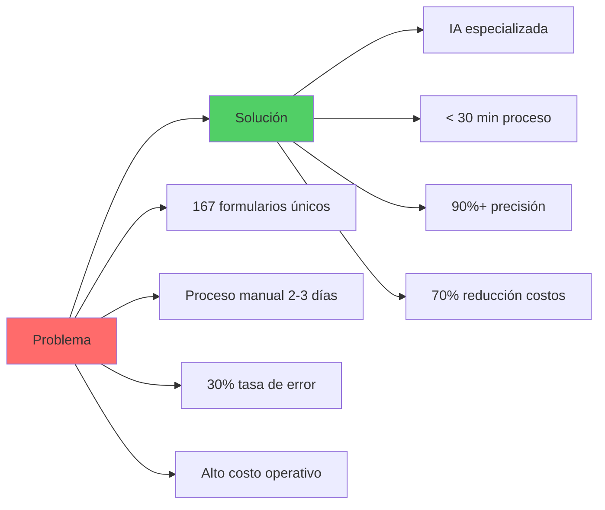
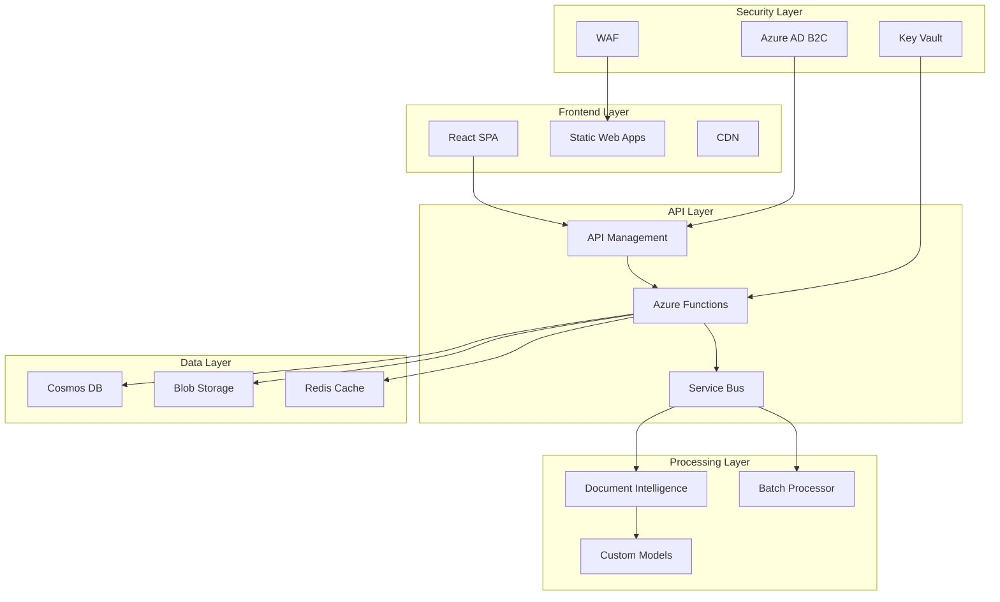
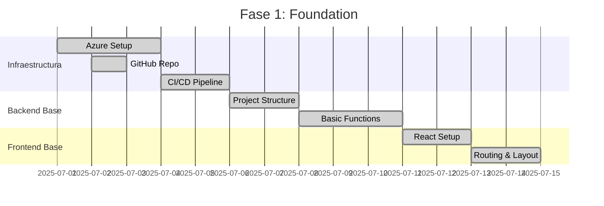
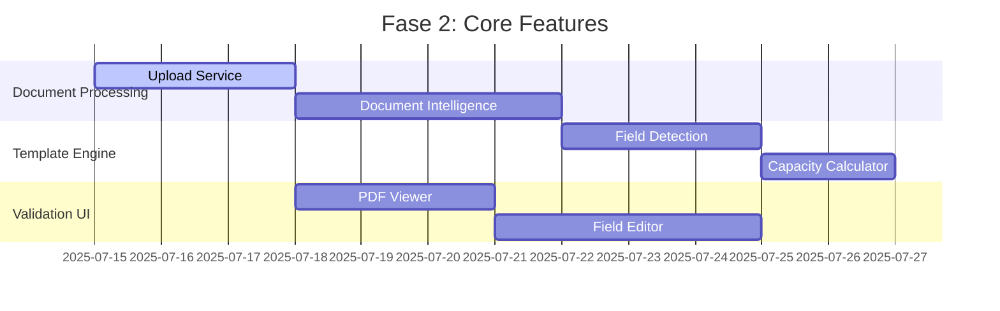
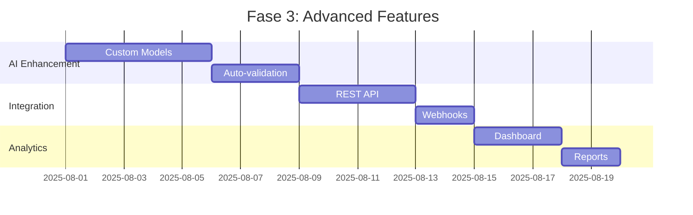

# PLANNING.md - Medical Forms Template Generator

> **Documento de Planificación Estratégica**  
> Versión: 1.0  
> Fecha: Julio 2025  
> Autor: Francisco Javier Martínez Peña

---

## 📋 ÍNDICE

1. [Visión del Proyecto](#visión-del-proyecto)
2. [Arquitectura del Sistema](#arquitectura-del-sistema)
3. [Stack Tecnológico Completo](#stack-tecnológico-completo)
4. [Herramientas de Desarrollo](#herramientas-de-desarrollo)
5. [Infraestructura Cloud](#infraestructura-cloud)
6. [Fases de Desarrollo](#fases-de-desarrollo)
7. [Presupuesto y Recursos](#presupuesto-y-recursos)
8. [Métricas de Éxito](#métricas-de-éxito)

---

## 🎯 VISIÓN DEL PROYECTO

### Declaración de Visión
> "Transformar la gestión de formularios médicos en México mediante inteligencia artificial, reduciendo el tiempo de procesamiento de días a minutos y estableciendo el estándar de la industria para la digitalización de documentos médicos."

### Objetivos Estratégicos

#### Corto Plazo (6 meses)
- 🎯 Lanzar MVP con 3 aseguradoras piloto (MAPFRE, AXA, INBURSA)
- 📈 Procesar 100+ formularios mensuales
- ⚡ Reducir tiempo de procesamiento a < 30 minutos
- 🎨 Alcanzar 90% de precisión en detección automática

#### Mediano Plazo (1 año)
- 🏢 Expandir a 10 aseguradoras
- 🤖 Implementar modelos custom de IA por aseguradora
- 💰 Generar ROI del 200%
- 🔌 Lanzar API pública para integraciones

#### Largo Plazo (2+ años)
- 🌎 Ser la plataforma líder en México
- 🏭 Procesar 1000+ formularios mensuales
- 🚀 Expandir a otros documentos médicos
- 💡 Licenciar tecnología a otros mercados

### Propuesta de Valor Única



---

## 🏗️ ARQUITECTURA DEL SISTEMA

### Arquitectura de Alto Nivel



### Arquitectura de Microservicios

```yaml
services:
  upload-service:
    purpose: "Manejo de carga de archivos"
    technology: "Azure Functions + Node.js"
    triggers: ["HTTP", "Blob Storage"]
    
  analysis-service:
    purpose: "Procesamiento con Document Intelligence"
    technology: "Azure Functions + Python"
    triggers: ["Service Bus", "HTTP"]
    
  template-service:
    purpose: "Gestión de plantillas"
    technology: "Azure Functions + Node.js"
    database: "Cosmos DB"
    
  validation-service:
    purpose: "Lógica de validación"
    technology: "Azure Functions + Node.js"
    cache: "Redis"
    
  notification-service:
    purpose: "Notificaciones y alertas"
    technology: "Azure Functions + Node.js"
    channels: ["Email", "Webhook"]
```

### Patrones de Diseño

#### 1. **Event-Driven Architecture**
```typescript
// Eventos del sistema
enum SystemEvents {
  PDF_UPLOADED = 'pdf.uploaded',
  ANALYSIS_COMPLETED = 'analysis.completed',
  TEMPLATE_VALIDATED = 'template.validated',
  ERROR_OCCURRED = 'error.occurred'
}

// Publicador de eventos
class EventPublisher {
  async publish(event: SystemEvent): Promise<void> {
    await serviceBus.sendMessage({
      subject: event.type,
      data: event.payload,
      timestamp: new Date()
    });
  }
}
```

#### 2. **Repository Pattern**
```typescript
// Abstracción de acceso a datos
interface ITemplateRepository {
  findById(id: string): Promise<Template>;
  save(template: Template): Promise<void>;
  findByInsurer(insurer: string): Promise<Template[]>;
}

// Implementación con Cosmos DB
class CosmosTemplateRepository implements ITemplateRepository {
  // Implementación específica
}
```

#### 3. **Circuit Breaker**
```typescript
// Protección contra fallos externos
class DocumentIntelligenceClient {
  private circuitBreaker = new CircuitBreaker({
    failureThreshold: 5,
    resetTimeout: 60000 // 1 minuto
  });

  async analyzeDocument(blob: Blob): Promise<AnalysisResult> {
    return this.circuitBreaker.execute(async () => {
      return await this.client.beginAnalyzeDocument(blob);
    });
  }
}
```

---

## 💻 STACK TECNOLÓGICO COMPLETO

### Frontend

| Categoría | Tecnología | Versión | Justificación |
|-----------|------------|---------|---------------|
| **Framework** | React | 18.2 | Ecosistema maduro, gran comunidad |
| **Lenguaje** | TypeScript | 5.1 | Type safety, mejor DX |
| **UI Library** | Material-UI | 5.14 | Componentes enterprise-ready |
| **Estado** | Redux Toolkit | 1.9 | Estado predecible, DevTools |
| **Routing** | React Router | 6.14 | Estándar de facto |
| **Forms** | React Hook Form | 7.45 | Performance, validación |
| **HTTP Client** | Axios | 1.4 | Interceptors, retry logic |
| **PDF Viewer** | react-pdf | 7.3 | Mejor soporte, personalizable |
| **Charts** | Recharts | 2.7 | Componentes React nativos |
| **Testing** | Jest + RTL | 29.6 | Estándar para React |
| **E2E Testing** | Playwright | 1.36 | Cross-browser, moderno |

### Backend

| Categoría | Tecnología | Versión | Justificación |
|-----------|------------|---------|---------------|
| **Runtime** | Node.js | 18 LTS | Estable, performance |
| **Framework** | Azure Functions | v4 | Serverless, escalable |
| **Lenguaje** | TypeScript | 5.1 | Consistencia con frontend |
| **Validation** | Joi | 17.9 | Esquemas robustos |
| **ORM/ODM** | Mongoose | 7.4 | Para Cosmos DB MongoDB API |
| **Queue** | Azure Service Bus | 7.16 | Mensajería confiable |
| **Cache** | Redis | 4.6 | Performance, sesiones |
| **Logging** | Winston | 3.10 | Structured logging |
| **Testing** | Jest | 29.6 | Consistencia, mocks |
| **API Docs** | OpenAPI | 3.0 | Estándar industria |

### Infraestructura

| Servicio | Propósito | Tier/SKU | Costo Estimado |
|----------|-----------|----------|----------------|
| **Static Web Apps** | Hosting Frontend | Standard | $9/mes |
| **Function Apps** | Backend API | Consumption | ~$50/mes |
| **Cosmos DB** | Base de datos principal | Serverless | ~$100/mes |
| **Blob Storage** | Archivos PDF | Hot tier | ~$20/mes |
| **Document Intelligence** | Análisis IA | S0 | ~$300/mes |
| **Redis Cache** | Caché y sesiones | Basic C0 | $50/mes |
| **Application Insights** | Monitoreo | Pay-as-you-go | ~$30/mes |
| **Key Vault** | Secretos | Standard | $5/mes |
| **Azure AD B2C** | Autenticación | MAU-based | ~$20/mes |

**Total Estimado**: ~$600/mes

---

## 🛠️ HERRAMIENTAS DE DESARROLLO

### Herramientas Esenciales

#### 1. **IDE y Editores**
```yaml
Visual Studio Code:
  version: "Latest"
  extensions:
    - ESLint
    - Prettier
    - TypeScript Hero
    - Azure Functions
    - Azure Tools
    - GitLens
    - Material Icon Theme
    - Thunder Client (API testing)
    - React snippets
    - Tailwind CSS IntelliSense
```

#### 2. **Control de Versiones**
```yaml
Git:
  version: "2.40+"
  config:
    - user.name
    - user.email
    - core.autocrlf: input
    - pull.rebase: true

GitHub Desktop:
  purpose: "GUI para desarrolladores menos técnicos"
  
GitHub CLI:
  purpose: "Automatización y scripting"
  version: "2.30+"
```

#### 3. **Azure Tools**
```bash
# Azure CLI
az --version  # 2.50+

# Azure Functions Core Tools
func --version  # 4.x

# Bicep CLI (IaC)
bicep --version  # 0.20+

# Storage Explorer
# GUI para Blob Storage y Cosmos DB
```

#### 4. **Node.js y Package Managers**
```yaml
Node.js:
  version: "18.17.0"  # LTS
  install: "via nvm para múltiples versiones"

npm:
  version: "9.8+"
  config:
    - registry: https://registry.npmjs.org/
    - save-exact: true

pnpm (alternativa):
  version: "8.6+"
  beneficios: "Menor uso de disco, más rápido"
```

#### 5. **Testing y Calidad**

```yaml
Testing:
  - Jest: "Unit testing"
  - React Testing Library: "Component testing"
  - Playwright: "E2E testing"
  - Newman: "API testing con Postman collections"

Calidad de Código:
  - ESLint: "Linting"
  - Prettier: "Formateo"
  - Husky: "Git hooks"
  - lint-staged: "Pre-commit checks"
  - SonarQube: "Análisis estático"
```

#### 6. **Debugging y Performance**

```yaml
Chrome DevTools:
  - React DevTools
  - Redux DevTools
  - Lighthouse

Azure Portal:
  - Application Insights
  - Log Analytics
  - Metrics Explorer

Local:
  - ndb: "Node debugging mejorado"
  - clinic.js: "Performance profiling"
```

### Configuración del Entorno de Desarrollo

#### 1. **Setup Inicial**
```bash
# 1. Clonar repositorio
git clone https://github.com/your-org/medical-forms-template-generator.git
cd medical-forms-template-generator

# 2. Instalar dependencias globales
npm install -g @azure/functions-core-tools@4
npm install -g @azure/static-web-apps-cli

# 3. Instalar dependencias del proyecto
npm install

# 4. Configurar variables de entorno
cp .env.example .env.local
# Editar .env.local con valores reales

# 5. Iniciar servicios locales
npm run dev
```

#### 2. **Docker para Desarrollo Local**
```dockerfile
# docker-compose.yml
version: '3.8'
services:
  cosmos-emulator:
    image: mcr.microsoft.com/cosmosdb/linux/azure-cosmos-emulator
    ports:
      - "8081:8081"
      - "10251-10254:10251-10254"
  
  azurite:
    image: mcr.microsoft.com/azure-storage/azurite
    ports:
      - "10000:10000"  # Blob
      - "10001:10001"  # Queue
      - "10002:10002"  # Table
  
  redis:
    image: redis:7-alpine
    ports:
      - "6379:6379"
```

---

## 🚀 INFRAESTRUCTURA CLOUD

### Azure Resources Organization

```yaml
Resource Groups:
  Production:
    name: "rg-medicalforms-prod-eastus2"
    resources:
      - Static Web App
      - Function Apps
      - Cosmos DB
      - Storage Accounts
      - Document Intelligence
      
  Development:
    name: "rg-medicalforms-dev-eastus2"
    resources:
      - Replicas de prod con SKUs menores
      
  Shared:
    name: "rg-medicalforms-shared-eastus2"
    resources:
      - Key Vault
      - Container Registry
      - Log Analytics Workspace
```

### Infraestructura como Código (IaC)

```bicep
// main.bicep - Ejemplo simplificado
param environment string = 'dev'
param location string = resourceGroup().location

// Static Web App
resource staticWebApp 'Microsoft.Web/staticSites@2022-09-01' = {
  name: 'swa-medicalforms-${environment}'
  location: location
  sku: {
    name: 'Standard'
    tier: 'Standard'
  }
  properties: {
    repositoryUrl: 'https://github.com/your-org/medical-forms'
    branch: environment == 'prod' ? 'main' : 'develop'
    buildProperties: {
      appLocation: '/frontend'
      apiLocation: '/backend'
      outputLocation: 'build'
    }
  }
}

// Cosmos DB
resource cosmosAccount 'Microsoft.DocumentDB/databaseAccounts@2023-04-15' = {
  name: 'cosmos-medicalforms-${environment}'
  location: location
  properties: {
    databaseAccountOfferType: 'Standard'
    consistencyPolicy: {
      defaultConsistencyLevel: 'Session'
    }
    capabilities: [
      {
        name: 'EnableServerless'
      }
    ]
  }
}

// Document Intelligence
resource cognitiveService 'Microsoft.CognitiveServices/accounts@2023-05-01' = {
  name: 'cog-medicalforms-${environment}'
  location: location
  sku: {
    name: 'S0'
  }
  kind: 'FormRecognizer'
}
```

### CI/CD Pipeline

```yaml
# .github/workflows/main.yml
name: Build and Deploy

on:
  push:
    branches: [main, develop]
  pull_request:
    branches: [main]

env:
  NODE_VERSION: '18.x'

jobs:
  build-and-test:
    runs-on: ubuntu-latest
    steps:
      - uses: actions/checkout@v3
      
      - name: Setup Node.js
        uses: actions/setup-node@v3
        with:
          node-version: ${{ env.NODE_VERSION }}
          cache: 'npm'
      
      - name: Install dependencies
        run: npm ci
      
      - name: Lint
        run: npm run lint
      
      - name: Test
        run: npm run test:ci
      
      - name: Build
        run: npm run build
      
      - name: Upload artifacts
        uses: actions/upload-artifact@v3
        with:
          name: build-artifacts
          path: |
            frontend/build
            backend/dist

  deploy-dev:
    if: github.ref == 'refs/heads/develop'
    needs: build-and-test
    runs-on: ubuntu-latest
    environment: development
    steps:
      - name: Deploy to Azure
        # Deployment steps
        
  deploy-prod:
    if: github.ref == 'refs/heads/main'
    needs: build-and-test
    runs-on: ubuntu-latest
    environment: production
    steps:
      - name: Deploy to Azure
        # Deployment steps
```

---

## 📅 FASES DE DESARROLLO

### Fase 1: Foundation (Semanas 1-4) ✅


### Fase 2: Core Features (Semanas 5-8) 🚧


### Fase 3: Advanced Features (Semanas 9-12) 📋


### Fase 4: Production Ready (Semanas 13-14) 🚀
- Performance optimization
- Security hardening
- Load testing
- Documentation completion
- User training
- Go-live preparation

---

## 💰 PRESUPUESTO Y RECURSOS

### Costos de Desarrollo

| Categoría | Detalle | Costo | Total |
|-----------|---------|-------|-------|
| **Personal** | | | |
| Full Stack Developer | 3 meses @ $15k/mes | $45,000 | |
| Tech Lead | 25% tiempo @ $5k/mes | $15,000 | |
| PM | 25% tiempo @ $4k/mes | $12,000 | |
| **Subtotal Personal** | | | **$72,000** |
| **Infraestructura** | | | |
| Azure (Dev+Prod) | 3 meses @ $800/mes | $2,400 | |
| Herramientas | Licencias y servicios | $1,500 | |
| **Subtotal Infra** | | | **$3,900** |
| **Otros** | | | |
| Capacitación | Azure certs, cursos | $2,000 | |
| Contingencia | 10% del total | $7,790 | |
| **TOTAL PROYECTO** | | | **$85,690** |

### ROI Proyectado

```
Costos Actuales (Anual):
- 3 analistas procesando formularios: $120,000
- Errores y reprocesos: $30,000
- Total: $150,000

Costos con Sistema (Anual):
- 1 analista supervisando: $40,000
- Infraestructura Azure: $7,200
- Mantenimiento: $10,000
- Total: $57,200

Ahorro Anual: $92,800
ROI Año 1: 108%
Payback Period: 11 meses
```

---

## 📊 MÉTRICAS DE ÉXITO

### KPIs Técnicos

| Métrica | Target | Medición |
|---------|--------|----------|
| **Uptime** | 99.9% | Application Insights |
| **Response Time** | < 500ms p95 | Application Insights |
| **Error Rate** | < 1% | Custom Dashboard |
| **CPU Usage** | < 70% avg | Azure Monitor |
| **Memory Usage** | < 80% avg | Azure Monitor |

### KPIs de Negocio

| Métrica | Baseline | 6 Meses | 1 Año |
|---------|----------|---------|-------|
| **Formularios/mes** | 10 | 100 | 300 |
| **Tiempo promedio** | 2 días | 30 min | 10 min |
| **Precisión IA** | N/A | 85% | 95% |
| **Satisfacción usuario** | N/A | 4.0/5 | 4.5/5 |
| **Costo por formulario** | $150 | $15 | $5 |

### Dashboard Ejecutivo

```typescript
// Estructura de métricas para dashboard
interface ExecutiveDashboard {
  realTime: {
    activeUsers: number;
    processingQueue: number;
    systemHealth: 'healthy' | 'degraded' | 'down';
  };
  daily: {
    formsProcessed: number;
    averageProcessingTime: number;
    errorRate: number;
    userSatisfaction: number;
  };
  monthly: {
    totalForms: number;
    costSavings: number;
    aiAccuracy: number;
    newInsurers: number;
  };
  alerts: Alert[];
}
```

---

## 📝 NOTAS FINALES

### Factores Críticos de Éxito
1. **Adopción del Usuario**: UX intuitiva y gamificada
2. **Precisión de IA**: Modelos especializados por aseguradora
3. **Performance**: Procesamiento rápido y confiable
4. **Escalabilidad**: Arquitectura serverless
5. **Seguridad**: Cumplimiento regulatorio

### Riesgos Principales
1. **Cambios en formatos PDF**: Mitigar con modelos adaptativos
2. **Costos de Azure**: Optimización continua
3. **Competencia**: Diferenciación por especialización
4. **Regulación**: Asesoría legal continua

### Próximos Pasos
1. ✅ Finalizar setup de infraestructura
2. 🚧 Completar integración con Document Intelligence
3. 📋 Desarrollar UI de validación
4. 📋 Implementar sistema de versionado
5. 📋 Crear documentación de usuario

---

**Documento mantenido por**: Francisco Javier Martínez Peña  
**Última actualización**: Julio 2025  
**Versión**: 1.0.0  
**Estado**: Activo